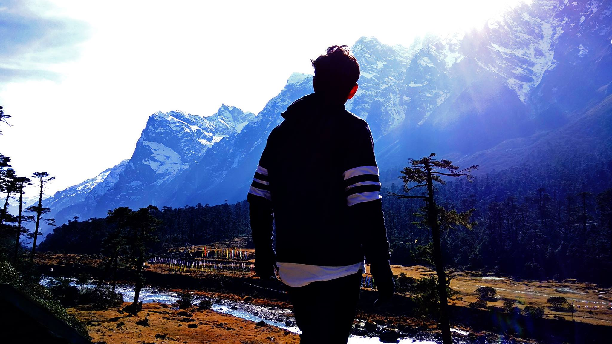
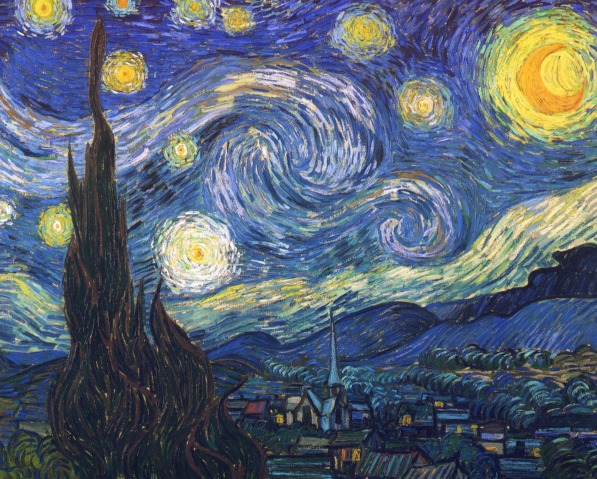
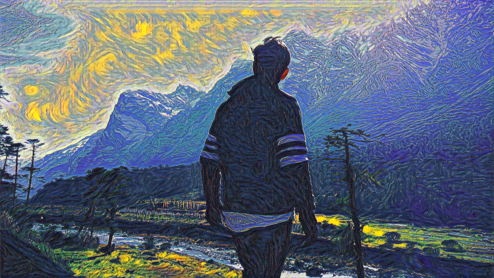

# Neural Style Transfer

## Introduction

This repository contains a PyTorch-based implementation of "A Neural Algorithm of Artistic Style" by L. Gatys, A. Ecker, and M. Bethge, which presents a method for transferring the artistic style of one input image onto another. You can read the paper here: http://arxiv.org/abs/1508.06576.

This implementation follows exactly the methods outlined in the paper and offers a simple and self-explanatory tutorial for using style transfer.

## Example

| Content Image  | Style image |
| ------------- | ------------- |
|   |   |

| Target style-transferred image  |
| ------------- |
|   |

## Requirements

- Python >= 3
- CUDA >= 8.0 (highly recommended)
- PyTorch >= 0.4.1

CUDA will enable GPU-based computation in PyTorch.

The required packages to run the notebook can be installed by running:

    pip install -r requirements.txt

Alternatively, you can download all required packages (and more) by downloading & installing Anaconda distribution from one of the following links:
* [Anaconda](https://www.anaconda.com/distribution/)
* [Mininconda](https://docs.conda.io/en/latest/miniconda.html)

## Using custom images

* Put the images you want to use for style transfer in the **images** folder.
* In the notebook, change the `content_path` and `style_path` to the respective images you want to use.
* The output images will get exported to the **output** folder.

## Controlling amount of _style_ or _content_

* In the notebook, change the `style_weights` to change the effect of each style layer on the output (higher weights for later layers means smaller style details in the target image, hence lower weights for later layers is preferrable).
* In the notebook, the ratio of `content_weight` and `style_weight` determines the trade-off between content and style of the image(lower ratio facilitates high rates of style transfer).
